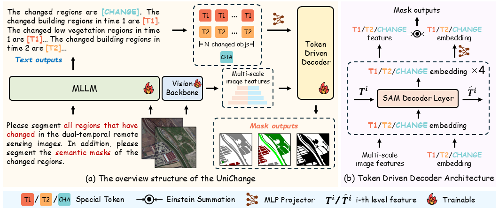

<h1 align="center"> UniChange: Unifying Change Detection with Multimodal Large Language Model </h1>

<h5 align="center"><em>Xu Zhang, Danyang Li, Xiaohang Dong, Tianhao Wu, Hualong Yu, Jianye Wang, Qicheng Li, and Xiang Li </em></h5>


# Overview ✨
- [Overview ✨](#overview-)
- [TODO List 📅](#todo-list-)
- [News 📢](#news-)
- [Introduction 📄](#introduction-)
- [Installation 🛠️](#installation-️)
- [License 🔑](#license-)
- [Acknowledgement 🤝](#acknowledgement-)
- [Citation 📚](#citation-)

# TODO List 📅
We will release the model code and checkpoints soon!🌈

- [x] Release environment setup
- [x] Release the training and inference code
- [ ] Release the dataset
- [ ] Release checkpoints

# News 📢
- **`2026/04/04`** Release the training and inference code.
- **`2026/02/21`** UniChange paper accepted by CVPR 2026. 🎉🎉🎉🎉.
- **`2025/11/04`** UniChange [paper](https://arxiv.org/abs/2511.02607) is available on arXiv.

# Introduction 📄 
Change detection (CD) is a fundamental task for monitoring and analysing land cover dynamics. While recent high performance models and high quality datasets have significantly advanced the field, a critical limitation persists. Current models typically acquire limited knowledge from single-type annotated data and cannot concurrently leverage diverse binary change detection (BCD) and semantic change detection (SCD) datasets. This constraint leads to poor generalisation and limited versatility. The recent advancements in Multimodal Large Language Models (MLLMs) introduce new possibilities for a unified CD framework. We leverage the language priors and unification capabilities of MLLMs to develop UniChange, the first MLLM-based unified change detection model. UniChange integrates generative language abilities with specialised CD functionalities. We introduce three special tokens: [T1], [T2], and [CHANGE], utilising their embeddings as the key to query variations. This approach successfully accommodates both BCD and SCD tasks. Furthermore, UniChange utilises text prompts to guide the identification of change categories, eliminating the reliance on predefined classification heads. This design allows UniChange to effectively acquire knowledge from multi-source datasets, even when their class definitions conflict. Experiments on four public benchmarks (WHU-CD, S2Looking, LEVIR-CD+, and SECOND) demonstrate SOTA performance, achieving IoU scores of 90.41, 53.04, 78.87, and 57.62, respectively, surpassing all previous methods. The code is available at [GitHub](https://github.com/NKU-HLT/UniChange/).

---

<p align="center">
  
</p>

Figure 1: The overview structure of UniChange is shown in (a). UniChange generates text outputs based on text instructions and dual-temporal remote sensing images. The text outputs incorporate a series of special tokens ([T1], [T2], and [CHANGE]). Concurrently, the dual-temporal remote sensing images undergo feature extraction via the Vision Backbone. These features, alongside the embeddings corresponding to the special tokens, are fed into the Token Driven Decoder. Ultimately, UniChange generates the masks corresponding to the text instructions. The overall structure of the Token Driven Decoder is shown in (b). It receives dual-temporal remote sensing image features and special token embeddings, generating corresponding masks.

# Installation 🛠️

1. Clone this repository and navigate to the base folder
```bash
git clone https://github.com/NKU-HLT/UniChange.git
cd UniChange
```

1. Install packages
```bash
conda create -n UniChange python=3.10 -y
conda activate UniChange
pip install -r requirements.txt
```

1. Install Flash-Attention
```bash
pip install flash-attn --no-build-isolation
git clone https://github.com/Dao-AILab/flash-attention.git
cd flash-attention
python setup.py install
```

# License 🔑
This code repository is licensed under [Apache 2.0](./LICENSE).

# Acknowledgement 🤝
We would like to thank the following projects for their contributions to this work:

- [LISA](https://github.com/JIA-Lab-research/LISA)
- [RSBuilding](https://github.com/Meize0729/RSBuilding)
- [SAM](https://github.com/facebookresearch/segment-anything)
  
# Citation 📚

If you find our project useful for your research, please consider citing our paper and codebase with the following BibTeX:

```bibtex
@article{zhang2025unichange,
  title={UniChange: Unifying Change Detection with Multimodal Large Language Model},
  author={Zhang, Xu and Li, Danyang and Dong, Xiaohang and Wu, Tianhao and Yu, Hualong and Wang, Jianye and Li, Qicheng and Li, Xiang},
  journal={arXiv preprint arXiv:2511.02607},
  year={2025}
}
```